# Sales Forecasting Application - Complete Flow Diagram

## Overview
This document presents a comprehensive flow diagram of the sales forecasting application developed for thesis research. The application demonstrates a complete forecasting pipeline including data processing, product classification, forecasting method selection, and evaluation methodologies.

## Application Architecture Flow

```mermaid
graph TD
    A[📁 Data Sources] --> B[🔄 Data Loading & Processing]
    B --> C[📊 Data Validation & Cleaning]
    C --> D[🏷️ Product Classification]
    D --> E[⚡ Intermittency Analysis]
    E --> F[🔮 Forecasting Methods Selection]
    F --> G[📈 Forecast Generation]
    G --> H[🧮 Results Evaluation]
    H --> I[📋 Comparison & Analysis]
    I --> J[📤 Export & Reporting]

    %% Data Sources Details
    A --> A1[Sales Data\n2022-2025.xlsx]
    A --> A2[Budget Data\nOrçamento2022-2025.xlsx]
    A --> A3[Specific Market SKUs\nMercado Específico]

    %% Classification Branches
    D --> D1[ABC Analysis\nSales Volume Based]
    D --> D2[XYZ Analysis\nVariability Based]
    D --> D3[ABC-XYZ Matrix\n9 Categories]

    %% Intermittency Categories
    E --> E1[Smooth Products\nLow CV², Low ADI]
    E --> E2[Intermittent Products\nLow CV², High ADI]
    E --> E3[Erratic Products\nHigh CV², Low ADI]
    E --> E4[Lumpy Products\nHigh CV², High ADI]

    %% Forecasting Methods
    F --> F1[Time Series Methods]
    F --> F2[Machine Learning Methods]
    F --> F3[Weighted Combination Methods]

    F1 --> F1A[ARIMA]
    F1 --> F1B[Simple Exponential Smoothing]
    F1 --> F1C[Simple Moving Average]
    F1 --> F1D[Teunter-Syntetos-Babai TSB]

    F2 --> F2A[XGBoost]
    F2 --> F2B[Linear Regression]

    F3 --> F3A[Custom Weighted Forecast]
    F3 --> F3B[SKU Ponderation Forecast]

    %% Evaluation Metrics
    H --> H1[Accuracy Metrics]
    H --> H2[Error Metrics]

    H1 --> H1A[Assertividade %]
    H2 --> H2A[Mean Squared Error MSE]
    H2 --> H2B[Mean Absolute Error MAE]
    H2 --> H2C[Mean Absolute Percentage Error MAPE]
```



## Detailed Process Flow

### 1. 📁 Data Ingestion Phase


### 2. 🔄 Data Processing Pipeline


### 3. 🏷️ ABC-XYZ Classification System

```mermaid
graph TD
    subgraph "ABC Analysis - Sales Volume"
        ABC1[Sort SKUs by Total Sales 2024]
        ABC2[Calculate Cumulative %]
        ABC3[Class A: 0-80% of Sales]
        ABC4[Class B: 80-95% of Sales]
        ABC5[Class C: 95-100% of Sales]
        ABC1 --> ABC2 --> ABC3
        ABC2 --> ABC4
        ABC2 --> ABC5
    end

    subgraph "XYZ Analysis - Demand Variability"
        XYZ1[Calculate Monthly Sales by SKU]
        XYZ2[Compute Coefficient of Variation CV]
        XYZ3[Class X: CV ≤ 0.2 Stable]
        XYZ4[Class Y: 0.2 < CV ≤ 0.5 Moderate]
        XYZ5[Class Z: CV > 0.5 Variable]
        XYZ1 --> XYZ2 --> XYZ3
        XYZ2 --> XYZ4
        XYZ2 --> XYZ5
    end

    subgraph "Combined Matrix - 9 Categories"
        M1[AX: High Value, Stable]
        M2[AY: High Value, Moderate]
        M3[AZ: High Value, Variable]
        M4[BX: Medium Value, Stable]
        M5[BY: Medium Value, Moderate]
        M6[BZ: Medium Value, Variable]
        M7[CX: Low Value, Stable]
        M8[CY: Low Value, Moderate]
        M9[CZ: Low Value, Variable]
    end

    ABC3 --> M1
    ABC3 --> M2
    ABC3 --> M3
    ABC4 --> M4
    ABC4 --> M5
    ABC4 --> M6
    ABC5 --> M7
    ABC5 --> M8
    ABC5 --> M9
```



### 4. ⚡ Intermittency Analysis Framework

```mermaid
graph TD
    subgraph "Demand Pattern Classification"
        IA1[Calculate Monthly Demand Pattern]
        IA2[Compute CV² - Coefficient of Variation Squared]
        IA3[Compute ADI - Average Demand Interval]
        IA4[Apply Classification Thresholds]
    end

    IA1 --> IA2
    IA1 --> IA3
    IA2 --> IA4
    IA3 --> IA4

    subgraph "Thresholds"
        T1[CV² Threshold: 0.49]
        T2[ADI Threshold: 1.32]
    end

    subgraph "Four Categories"
        C1[Smooth: CV² ≤ 0.49 & ADI ≤ 1.32\nRegular, Predictable Demand]
        C2[Intermittent: CV² ≤ 0.49 & ADI > 1.32\nRegular Size, Sporadic Timing]
        C3[Erratic: CV² > 0.49 & ADI ≤ 1.32\nIrregular Size, Regular Timing]
        C4[Lumpy: CV² > 0.49 & ADI > 1.32\nIrregular Size, Sporadic Timing]
    end

    IA4 --> C1
    IA4 --> C2
    IA4 --> C3
    IA4 --> C4

    subgraph "Forecasting Implications"
        FI1[Smooth → Traditional Time Series Methods]
        FI2[Intermittent → Specialized Methods TSB]
        FI3[Erratic → Adaptive/Robust Methods]
        FI4[Lumpy → Complex Combination Methods]
    end

    C1 --> FI1
    C2 --> FI2
    C3 --> FI3
    C4 --> FI4
```



### 5. 🔮 Forecasting Methods Architecture


### 6. 📈 SKU Ponderation Weighted Forecasting (Detailed)


### 7. 🧮 Evaluation & Metrics Framework

```mermaid
graph TD
    subgraph "Accuracy Metrics"
        AM1[Assertividade %\n1 - |Actual - Forecast| / max|Actual, Forecast|]
        AM2[Weighted by Actual Sales Volume]
    end

    subgraph "Error Metrics"
        EM1[MSE: Mean Squared Error\n(Actual - Forecast)²]
        EM2[MAE: Mean Absolute Error\n|Actual - Forecast|]
        EM3[MAPE: Mean Absolute Percentage Error\n|Actual - Forecast| / |Actual| * 100]
    end

    subgraph "Comparative Analysis"
        CA1[Method vs Method Comparison]
        CA2[Category-Based Performance]
        CA3[Time-Based Performance Evolution]
        CA4[Best Method Recommendation by Category]
    end

    subgraph "Aggregation Levels"
        AL1[Individual SKU Level]
        AL2[Product Family Level]
        AL3[ABC-XYZ Category Level]
        AL4[Intermittency Category Level]
        AL5[Overall Portfolio Level]
    end

    AM1 --> CA1
    AM2 --> CA1
    EM1 --> CA1
    EM2 --> CA1
    EM3 --> CA1

    CA1 --> AL1
    CA1 --> AL2
    CA1 --> AL3
    CA1 --> AL4
    CA1 --> AL5
```

### 8. 📊 Interactive Dashboard Components

```mermaid
graph LR
    subgraph "Navigation Pages"
        NP1[🏠 Overview - Data Summary]
        NP2[📈 Time Series - Individual SKU Analysis]
        NP3[📊 Aggregated Series - Family/Manager View]
        NP4[📋 ABC/XYZ Analysis - Classification]
        NP5[⚡ Intermittency Analysis - Demand Patterns]
        NP6[⚖️ Weighted Forecast - Custom Combinations]
        NP7[🔮 Forecasting Methods - Method Testing]
        NP8[🆚 Results Comparison - Performance Analysis]
    end

    subgraph "Interactive Features"
        IF1[Dynamic Filtering by Family/SKU]
        IF2[Real-time Parameter Adjustment]
        IF3[Forecast Horizon Selection]
        IF4[Method Comparison Interface]
        IF5[Export Functionality]
        IF6[Visual Charts & Plots]
    end

    subgraph "Data Flow Between Pages"
        DF1[Session State Management]
        DF2[Cross-Page Data Sharing]
        DF3[Results Caching]
        DF4[Filter Persistence]
    end
```



## Key Forecasting Methodology Contributions

### 1. **Multi-Dimensional Product Classification**
- **ABC Analysis**: Revenue-based prioritization (Pareto principle)
- **XYZ Analysis**: Demand variability assessment using coefficient of variation
- **9-Category Matrix**: Combined ABC-XYZ for strategic segmentation
- **Intermittency Classification**: 4-quadrant demand pattern analysis (Smooth, Intermittent, Erratic, Lumpy)

### 2. **Method Selection Strategy**
- **Category-Specific Recommendations**: Different methods for different product types
- **Demand Pattern Matching**: TSB for intermittent, traditional methods for smooth
- **Complexity Scaling**: Simple methods for stable products, complex for variable
- **Performance-Based Selection**: Empirical method comparison across categories

### 3. **Advanced Weighted Forecasting**
- **Multi-Component Integration**: 6 different historical and forward-looking components
- **Hierarchical Consistency**: Top-down disaggregation with bottom-up validation
- **Quarterly Period Locking**: Consistent forecasts within business quarters
- **Budget Integration**: External planning data incorporation

### 4. **Comprehensive Evaluation Framework**
- **Multiple Metrics**: Accuracy (Assertividade) and Error metrics (MSE, MAE, MAPE)
- **Weighted Evaluation**: Performance weighted by sales volume importance
- **Category-Specific Analysis**: Method performance by product classification
- **Temporal Performance**: Month-by-month accuracy tracking

### 5. **Practical Implementation Features**
- **Real-time Processing**: Interactive parameter adjustment and immediate results
- **Scalable Architecture**: Handles hundreds of SKUs efficiently
- **Export Capabilities**: Results export for further analysis
- **Visual Analytics**: Interactive charts for pattern identification

## Research Contribution Summary

This application demonstrates a complete forecasting pipeline that addresses key challenges in SKU-level demand forecasting:

1. **Product Heterogeneity**: Through multi-dimensional classification
2. **Method Selection**: Through category-specific recommendations
3. **Forecast Accuracy**: Through ensemble and weighted approaches
4. **Business Integration**: Through budget incorporation and hierarchical consistency
5. **Performance Evaluation**: Through comprehensive metrics and comparative analysis

The methodology provides a framework for selecting and evaluating forecasting methods based on product characteristics, contributing to more effective demand planning in retail/FMCG environments. 