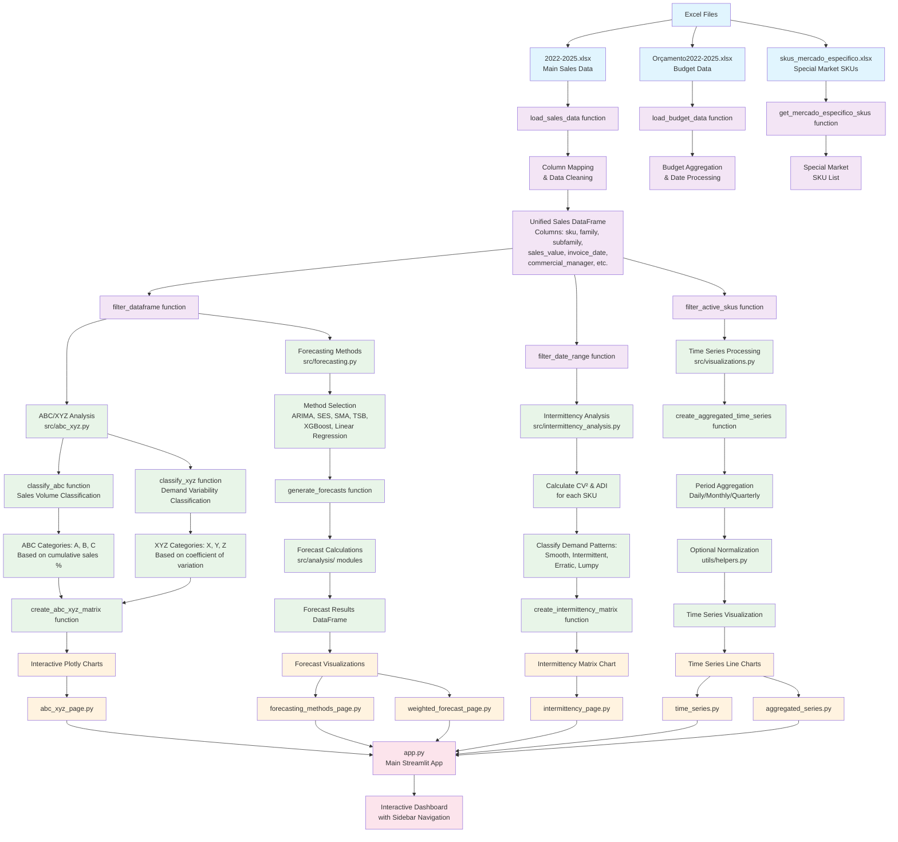

# Data Processing Flow Diagram
## SKU Sales Dashboard - Complete Data Pipeline



## Detailed Data Processing Steps

### 1. Data Sources & Loading
- **Primary Data**: `2022-2025.xlsx` contains main sales data with columns:
  - `Gestor Comercial`, `Familia`, `Sub Familia`, `Gramagem`, `Formato`
  - `Material Mapeado` (SKU), `Valor Kg` (sales value), `Data do faturamento` (date)
- **Budget Data**: `Orçamento2022-2025.xlsx` for forecast comparison
- **Special Market**: `skus_mercado_especifico.xlsx` for market segmentation

### 2. Data Transformation Pipeline

#### 2.1 Column Standardization (`data_loader.py`)
```python
column_mapping = {
    'Data do faturamento': 'invoice_date',
    'Familia': 'family',
    'Sub Familia': 'subfamily', 
    'Material Mapeado': 'sku',
    'Valor Kg': 'sales_value',
    'Gestor Comercial': 'commercial_manager'
}
```

#### 2.2 Data Types & Cleaning
- Convert dates to `pd.datetime`
- Handle missing values
- Filter by 15 specific families (as per workspace rules)
- Validate data integrity

#### 2.3 Filtering Layer (`utils/filters.py`)
- **Date Range Filtering**: `filter_date_range()`
- **Multi-column Filtering**: `filter_dataframe()`
- **Active SKU Filtering**: Based on sales activity in specified periods

### 3. Analysis Modules

#### 3.1 ABC/XYZ Classification (`src/abc_xyz.py`)
```python
# ABC Analysis - Sales Volume
A: 0-80% of total sales (high volume)
B: 80-95% of total sales (medium volume)  
C: 95-100% of total sales (low volume)

# XYZ Analysis - Demand Variability
X: CV ≤ 20% (stable demand)
Y: 20% < CV ≤ 50% (moderate variability)
Z: CV > 50% (high variability)
```

#### 3.2 Intermittency Analysis (`src/intermittency_analysis.py`)
```python
# Classification based on CV² and ADI
Smooth: CV² ≤ 0.49 & ADI ≤ 1.32
Intermittent: CV² ≤ 0.49 & ADI > 1.32
Erratic: CV² > 0.49 & ADI ≤ 1.32
Lumpy: CV² > 0.49 & ADI > 1.32
```

#### 3.3 Time Series Processing (`src/visualizations.py`)
- **Aggregation**: Daily → Monthly → Quarterly
- **Normalization**: 0-1 scaling using `utils/helpers.py`
- **Interactive Charts**: Plotly with range sliders and zoom

#### 3.4 Forecasting Pipeline (`src/forecasting.py`)
```python
Methods Available:
- ARIMA(p,d,q)
- Simple Exponential Smoothing (SES)
- Simple Moving Average (SMA)
- Teunter-Syntetos-Boylan (TSB)
- XGBoost with lags
- Linear Regression with lags
- Weighted SKU Ponderation
```

### 4. Visualization & UI Layer

#### 4.1 Streamlit Pages Architecture
- **Overview** (`pages/overview.py`): KPIs and main trends
- **Time Series** (`pages/time_series.py`): Individual SKU analysis
- **Aggregated Series** (`pages/aggregated_series.py`): Group-level analysis
- **ABC/XYZ** (`pages/abc_xyz_page.py`): Classification matrices
- **Intermittency** (`pages/intermittency_page.py`): Demand pattern analysis
- **Forecasting** (`pages/forecasting_methods_page.py`): Prediction models

#### 4.2 Interactive Features
- **Dynamic Filtering**: Family, subfamily, date ranges
- **Real-time Updates**: Charts update based on filter selections
- **Export Capabilities**: Download filtered data and charts
- **Performance Optimization**: Caching for large datasets

### 5. Data Flow Control

#### 5.1 Session State Management
```python
st.session_state.sales_data     # Main dataset
st.session_state.data_loaded    # Loading status
st.session_state.filtered_data  # Current filtered view
st.session_state.analysis_cache # Cached analysis results
```

#### 5.2 Error Handling & Validation
- **File Validation**: Check required columns exist
- **Data Quality**: Handle missing dates, negative values
- **Performance**: Lazy loading for large datasets
- **User Feedback**: Progress bars and error messages

### 6. Key Libraries & Dependencies

#### 6.1 Core Processing
- **pandas**: Data manipulation and analysis
- **numpy**: Numerical computations
- **plotly**: Interactive visualizations
- **streamlit**: Web application framework

#### 6.2 Advanced Analytics
- **statsmodels**: Time series forecasting (ARIMA, ETS)
- **xgboost**: Machine learning forecasting
- **scikit-learn**: Linear regression and preprocessing

#### 6.3 Data Handling
- **openpyxl**: Excel file processing
- **datetime**: Date/time manipulations
- **typing**: Type hints for better code quality

This comprehensive flow ensures:
1. **Data Integrity**: Consistent column mapping and validation
2. **Performance**: Efficient filtering and caching mechanisms
3. **Flexibility**: Multiple analysis methods and visualization options
4. **User Experience**: Interactive filters and real-time updates
5. **Maintainability**: Modular structure with clear separation of concerns 