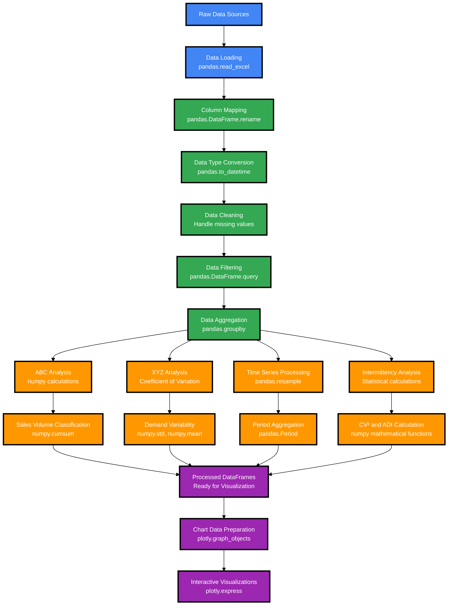

# Data Processing Flow Diagram
## SKU Sales Dashboard - Data Processing Pipeline

## Data Processing Steps

### 1. Data Extraction & Loading
- **pandas**: Read data from various sources
- **Column standardization**: Map original column names to standard format

### 2. Data Processing
- **Data type conversion**: Convert dates using `pandas.to_datetime()`
- **Data cleaning**: Handle missing values and outliers
- **Filtering**: Apply business rules using `pandas.query()`

### 3. Data Transformation
- **Aggregation**: Group data by SKU, family, time periods using `pandas.groupby()`
- **Time series preparation**: Create period indexes with `pandas.resample()`

### 4. Statistical Analysis
- **ABC Classification**: Calculate cumulative percentages using `numpy.cumsum()`
- **XYZ Classification**: Compute coefficient of variation with `numpy.std()` and `numpy.mean()`
- **Intermittency Analysis**: Calculate CV² and ADI using mathematical functions
- **Time series metrics**: Statistical calculations for demand patterns

### 5. Output Preparation
- **Data structuring**: Prepare processed DataFrames for visualization
- **Chart data formatting**: Transform data for plotly visualization requirements

## Key Libraries Used

| Library | Purpose | Main Functions |
|---------|---------|----------------|
| **pandas** | Data manipulation | `read_excel()`, `groupby()`, `resample()`, `to_datetime()` |
| **numpy** | Numerical calculations | `std()`, `mean()`, `cumsum()`, mathematical operations |
| **plotly** | Visualization | `graph_objects`, `express` for interactive charts |

## Processing Flow Summary

1. **Extract** → Load raw data using pandas
2. **Transform** → Clean, map columns, convert data types  
3. **Aggregate** → Group and summarize data by business dimensions
4. **Analyze** → Apply statistical methods for classification
5. **Prepare** → Format data for visualization and reporting 